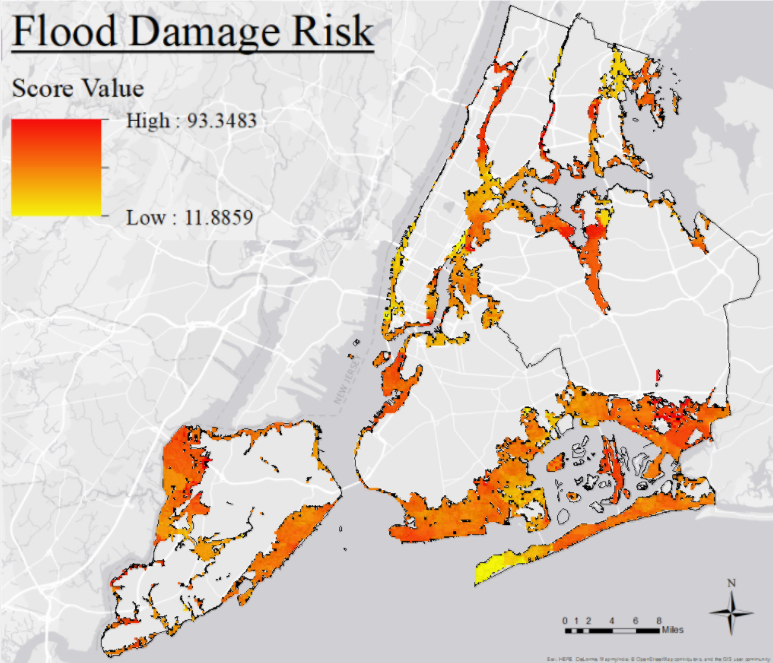

### Estimating flood damage risk in NYC

CUSP-GX 7003: Civic Analytics & Urban Intelligence  
Prof. Constantine Kontokosta   
Fall 2017  
Project Team: Anupama Santhosh, Andrew Nell, Hongkai He, Charlie Moffett 

### EXECUTIVE SUMMARY:
Floods are among the most common and most destructive natural disasters. New York City is particularly susceptible to flood disasters due not only to the frequency of storm surges, but also the severe financial consequences of inundation. Accounting for localized vulnerability to flood damage remains a considerable obstacle to improving urban resilience. In this paper, we considered the potential of various characteristics of flood-prone buildings to indicate existing damage resilience and attempt to quantify the propensity for future property wreckage as a composite Flood Damage Risk score. To create such a score, two different aspects are needed: magnitude of the effect that a building feature has on overall risk, and direction of the effect that a feature has on the final risk proxy variable. After exploring a number of methodologies, we use Linear Discriminant Analysis (LDA) to specify feature importance and the directional effect. Ground truthing for lowest floor elevation is conducted via manual review of Department of Building construction drawings. Features are scaled across a range of values between 0 and 1 to signify the assorted predictive power of original variables toward building damage extent. These weights are then applied to normalized variables and resultant scores are mapped to a 100-point scale. Despite challenges in estimating and validating building measures relevant to flood damage mitigation, as well as assessing their relative impact, our results indicate that a more nuanced approach than traditional flood zone designations for assessing inundation risk could improve the effectiveness of long-term adaptive planning in urban floodplains.
EXECUTIVE SUMMARY: Floods are among the most common and most destructive natural disasters. New York City is particularly susceptible to flood disasters due not only to the frequency of storm surges, but also the severe financial consequences of inundation. Accounting for localized vulnerability to flood damage remains a considerable obstacle to improving urban resilience. In this paper, we considered the potential of various characteristics of flood-prone buildings to indicate existing damage resilience and attempt to quantify the propensity for future property wreckage as a composite Flood Damage Risk score. To create such a score, two different aspects are needed: magnitude of the effect that a building feature has on overall risk, and direction of the effect that a feature has on the final risk proxy variable. After exploring a number of methodologies, we use Linear Discriminant Analysis (LDA) to specify feature importance and the directional effect. Ground truthing for lowest floor elevation is conducted via manual review of Department of Building construction drawings. Features are scaled across a range of values between 0 and 1 to signify the assorted predictive power of original variables toward building damage extent. These weights are then applied to normalized variables and resultant scores are mapped to a 100-point scale. Despite challenges in estimating and validating building measures relevant to flood damage mitigation, as well as assessing their relative impact, our results indicate that a more nuanced approach than traditional flood zone designations for assessing inundation risk could improve the effectiveness of long-term adaptive planning in urban floodplains.

New York City - risk scoring using fixed story-size BFEs
